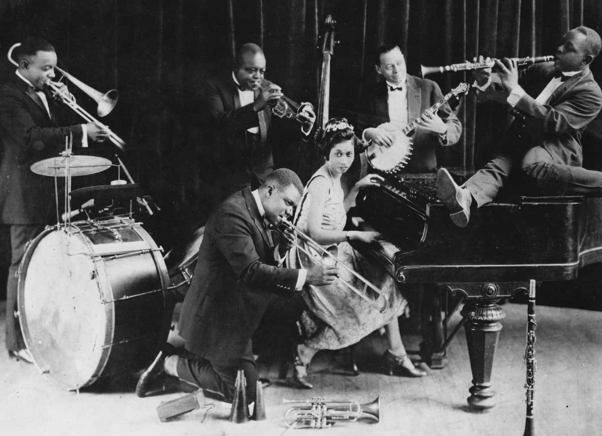

## Introduction
Jazz, with its soulful melodies and improvisational flair, has left an indelible mark on the world of music. In this article, we delve into the profound influence of jazz on various genres, exploring its evolution and enduring legacy.

## The Roots of Jazz
Born in the African American communities of New Orleans, jazz emerged as a vibrant amalgamation of blues, ragtime, and brass band music. We'll trace its early roots and the innovative contributions of legendary musicians like Louis Armstrong and Duke Ellington.

## Swing and Big Band Era
The swing era of the 1930s and 1940s brought jazz to the forefront of popular music. We explore the infectious rhythms of big bands, the elegant dance halls, and the cultural impact of swing on American society.

## Bebop and Jazz Revolution
Bebop, a subgenre of jazz, marked a radical departure from the danceable tunes of the swing era. We'll discuss how bebop's complex harmonies and fast tempos revolutionized jazz and paved the way for modern jazz styles.

## Fusion and Beyond
In the 1960s and beyond, jazz artists began experimenting with fusion, blending jazz elements with rock, funk, and electronic music. We examine how fusion redefined the genre and attracted a broader audience.

## Jazz's Influence on Hip-Hop
Jazz's influence extends beyond its own genre. We'll explore how hip-hop artists have sampled jazz recordings and incorporated jazz-inspired beats, contributing to the unique sonic landscape of hip-hop music.

## Jazz and Civil Rights Movement
Jazz has often been intertwined with social and political movements. We discuss its role during the Civil Rights Movement, as musicians used their art to express resistance and solidarity.

## Modern Jazz Innovators
Contemporary jazz continues to push boundaries and break new ground. We highlight some of the modern jazz innovators who are shaping the genre and captivating audiences worldwide.

## Conclusion
Jazz remains a living art form, a testament to the power of creativity and innovation. Its influence on modern music is immeasurable, and its ability to evoke emotion and captivate listeners endures as a testament to its timeless appeal.